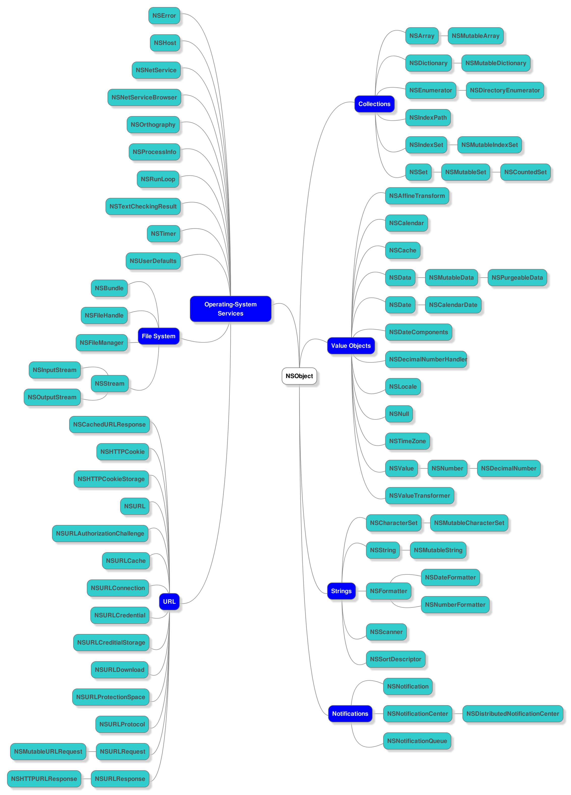
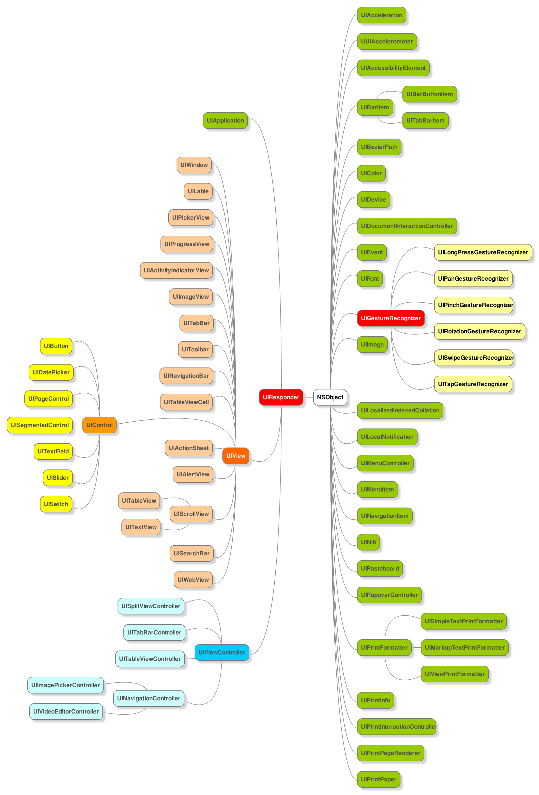

# Cocoa Framework

Cocoa 是OS X和iOS操作系统的程序运行环境.

NSObject, Foundation & UIKit.

对象生命周期简化 : 
	alloc - init - doSomething - retain - release - release - dealloc

Everything you see on Screen is UIView.

# iOS Framework :
* Cocoa Touch Layer
* Media Layer
* Core Services Layer
* Core OS Layer

## Cocoa Touch Layer
* UIKit
* AddressBookUI
* EventKitUI
* GameKit
* MapKit
* MessageUI
* Twitter
* iAd

## Media Layer
* AVFoundation
* AssetsLibrary
* AudioToolbox
* AudioUnit
* CoreAudio
* CoreGraphics
* CoreAnimation
* CoreImage
* CoreMIDI
* CoreText
* CoreVideo
* GLKit
* GameController
* ImageIO
* MediaAccessibility
* MediaPlayer
* OpenAL
* OpenGLES
* QuartzCore
* SpriteKit
* SceneKit

## Core Services Layer
* Accounts
* AdSupport
* AddressBook
* CFNetwork:对基于CFStream和CFSocoket的抽象,包括CFHttp和CFFtp
* CoreData:持久化框架
* CoreFoundation
* CoreLocation
* CoreMedia
* CoreMotion
* CoreTelephony
* EventKit
* Foundation
* JavaScriptCore
* MobileCoreServices
* MultipeerConnectivity
* NewsstandKit
* PassKit
* QuickLook
* Social
* StoreKit
* SystemConfiguration
* UIAutomation
* SQLite

## Core OS Layer
* Accelerate
* CoreBluetooth
* ExternalAccessory
* Security
* System

