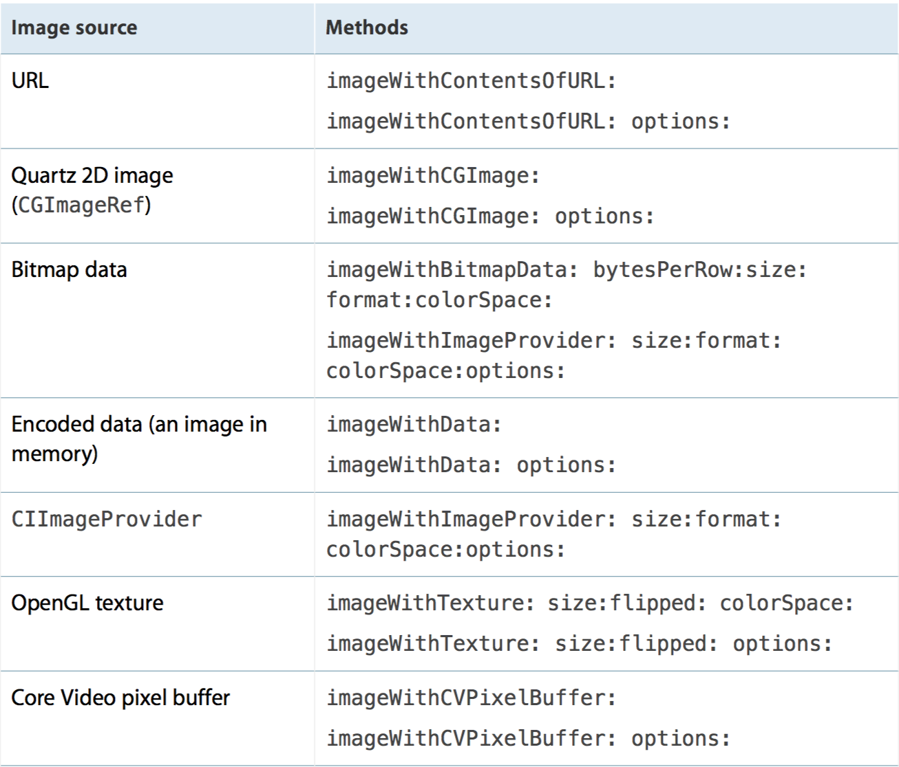

# CoreImage

CoreImage是一个图像框架,它基于OpenGL顶层创建,底层则用着色器来处理图像,这意味着它利用了GPU基于硬件加速来处理图像.

核心成员
CIContext: 上下文类,如CoreGraphics以及CoreData中的上下文用于处理绘制渲染以及处理托管对象一样,CoreImage的上下文也是实现对图像处理的具体对象. 这里需要注意的是在Context创建的时候, 我们需要给它设定为是基于GPU还是CPU. 基于GPU的话,处理速度更快,因为利用了GPU硬件的并行优势. 但是GPU受限于硬件纹理尺寸,而且如果你的程序在后台继续处理和保存图片的话,那么需要使用CPU,因为当app切换到后台状态时GPU处理会被打断.
CIFilter: 图像处理滤镜,每种滤镜有不同的参数设置.
CIImage: Core Image框架中的图像类型,主要用于输入和输出图像.

Core Image is an image processing and analysis technology designed to provide near real-time processing for still and video images. It operates on image data types from the Core Graphics, Core Video, and Image I/O frameworks, using either a GPU or CPU rendering path.

* CIFilter is a mutable object that represents an effect. A filter object has at least one input parameter and produces an output image.
* CIImage is an immutable object that represents an image. You can synthesize image data or provide it from a file or the output of another CIFilter object.
	* Keep in mind that a CIImage object is really an image recipe; Core Image doesn’t actually produce any pixels until it’s called on to render results to a destination.
* CIContext is an object through which Core Image draws the results produced by a filter. A Core Image context can be based on the CPU or the GPU.
	* use context to draw the output image
	* A Core Image context represents a drawing destination. The destination determines whether Core Image uses the GPU or the CPU for rendering. CPU rendering is slower than GPU rendering. But in the case of GPU rendering, the resulting image is not displayed until after it is copied back to CPU memory and converted to another image type such as a UIImage object.
	* Don’t create a CIContext object every time you render.
Contexts store a lot of state information; it’s more efficient to reuse them.

Basic : 

	CoreImage.framework
	#import <CoreImage/CoreImage.h>
	
```objectivec
CIContext *context = [CIContext contextWithOptions:nil];
CIImage *image = [CIImage imageWithContentsOfURL:myURL];

CIFilter *filter = [CIFilter filterWithName:@"CISepiaTone"];
[filter setValue:image forKey:kCIInputImageKey];
[filter setValue:@0.8f forKey:kCIInputIntensityKey];

CIImage *result = [filter valueForKey:kCIOutputImageKey];

// Render the CIImage to a Core Graphics image that is ready for display or saving to a file.
CGRect extent = [result extent];
CGImageRef cgImage = [context createCGImage:result fromRect:extent];
```

### CIFilter

parameters attribute value data types : 

Data Type |Object
----------|--------
Strings   |NSString
Float     |NSNumber
Vectors   |CIVector
Colors    |CIColor
Images    |CIImage
Transforms|NSData

### CIContext

Real-Time Performance :

```objectivec
EAGLContext *myEAGLContext = [[EAGLContext alloc]
initWithAPI:kEAGLRenderingAPIOpenGLES2];
NSDictionary *options = @{ kCIContextWorkingColorSpace : [NSNull null] };
CIContext *myContext = [CIContext contextWithEAGLContext:myEAGLContext
options:options];
```

### CIImage


#### Detecting Faces, Eyes and Mouth
```objectivec
CIContext *context = [CIContext contextWithOptions:nil];
NSDictionary *opts = @{ CIDetectorAccuracy : CIDetectorAccuracyHigh };
CIDetector *detector = [CIDetector detectorOfType:CIDetectorTypeFace context:context options:opts];
opts = @{ CIDetectorImageOrientation :[[myImage properties] valueForKey:kCGImagePropertyOrientation] };
NSArray *features = [detector featuresInImage:myImage options:opts];

for (CIFaceFeature *f in features)
{
    NSLog(NSStringFromRect(f.bounds));
    if (f.hasLeftEyePosition)
        NSLog("Left eye %g %g", f.leftEyePosition.x. f.leftEyePosition.y);
    if (f.hasRightEyePosition)
        NSLog("Right eye %g %g", f.rightEyePosition.x. f.rightEyePosition.y);
    if (f.hasmouthPosition)
        NSLog("Mouth %g %g", f.mouthPosition.x. f.mouthPosition.y);
}
```

#### Subclassing CIFilter: Recipes for Custom Effects
```objectivec
To subclass a filter you need to perform the following tasks:

	* Declare properties for the filter’s input parameters. You must prefix each input parameter name with input, such as inputImage.
	* Override the setDefaults method, if necessary. (It’s not necessary in this example because the input parameters are set values.)
	* Override the outputImage method.
```


# Image I/O

	ImageIO.framework
	#import <ImageIO/ImageIO.h>


# 拉伸图片

	- (UIImage *)resizableImageWithCapInsets:(UIEdgeInsets)capInsets resizingMode:(UIImageResizingMode)resizingMode
	UIImageResizingModeStretch：拉伸模式，通过拉伸UIEdgeInsets指定的矩形区域来填充图片
	UIImageResizingModeTile：平铺模式，通过重复显示UIEdgeInsets指定的矩形区域来填充图片

	CGFloat top = 25; // 顶端盖高度
	CGFloat bottom = 25 ; // 底端盖高度
	CGFloat left = 10; // 左端盖宽度
	CGFloat right = 10; // 右端盖宽度
	UIEdgeInsets insets = UIEdgeInsetsMake(top, left, bottom, right);
	// 指定为拉伸模式，伸缩后重新赋值
	image = [image resizableImageWithCapInsets:insets resizingMode:UIImageResizingModeStretch];


# CIImage 操作

	CVPixelBufferRef pixelBuffer = (CVPixelBufferRef) CMSampleBufferGetImageBuffer(sampleBuffer);
	CIImage *image = [CIImage imageWithCVPixelBuffer:pixelBuffer];
	image = [image imageByApplyingTransform:CGAffineTransformMakeRotation(M_PI)];
	CIContext *context = [CIContext contextWithOptions:nil];
	CGImageRef cgImage = [context createCGImage:image fromRect:[image extent]];
	UIImage *uiImage = [UIImage imageWithCGImage:cgImage];
