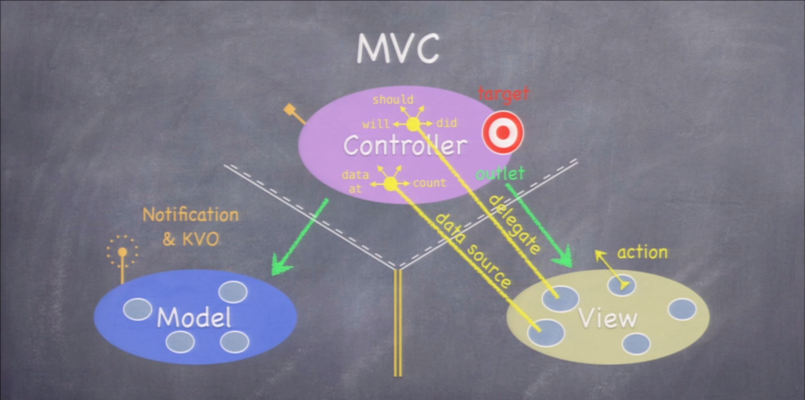

# Stanford iOS 2013-2014

## Lecture 1
Model, Controller and View


## Lecture 2
```objectivec
#import <Foundation/Foundation.h>

@interface BombCube : NSObject

// Xcode will generate setter and getter automatically and synthesize variables.
@property (nonatomic) NSInteger x;
@property (nonatomic) NSInteger y;

@property (nonatomic) int aroundBombs;

@property (nonatomic) BOOL isBomb;
@property (nonatomic) BOOL isOpen;
@property (nonatomic) BOOL isFlag;

// + public API, - private API
+(void)printMe;

@end
```
```objectivec
#import "BombCube.h"

// Local Variables defined here.
@interface BombCube()

@end

@implementation BombCube
// If we override setter and getter method, we have to use @synthesize variable = _variable

+(void)printMe
{
    NSLog(@"This is me:");
}

@end
```

## Lecture 3,4,5,6,7,8


# Stanford iOS 2015 in swift

## Lecture 1
* xCode 6.1.1

	Screen resolution problem :  
	-> auto layout -> constraints :  
	-> vertically and horizontally  
	-> yellow or orange dot lines means adding constraints  
	-> "update frames" : move and show results

all objects live in the heap.

**let** is the same as **var** except it's a constant.

swift is strong typed. get type from context. specify type.
type? -> optional type -> optional! to specify type.

all properties have to be initialized when the object is initialized.

## Lecture 2
* Array

	```swift
	var operanStack = Array<Double>()
	operanStack.append(0)
	```

* **magic variable**

	```swift
	var displayValue: Double {
		get{
			return NSNumberFormatter().numberFromString(display.text!)!.doubleValue
		}
		set{
			display.text = "\(newValue)"
		}
	}
	```

* func, parameter and parameter

**WHAT !!!**

* manual layout

		add new Constraints -> "update frames" fix
		how to start it over ? -> "Reset or Clear Constraints"

* **MVC**
	* **Model** = What your application is
	* **Controller** = How your Model is presented
	* **View** = Your Controller's minions
	
	Communication between camps:
	
	1. **Controller**s can always talk directly to their **Model**
	2. **Controller**s can also talk directly to their **View** (outlet)
	3. The **Model** and **View** should never speak to each other
	4. The **View** sends *action*s to **Controller** when things happen in the UI(View -> Controller = action -> target)
	5. The **Controller** sets itself as the **View**'s delegate (protocol : delegate : will, should, did)
	6. **View**s do not own the date they display. *data source*(delegate) in **Controller** (data at, count)
	7. **Model** use *broadcast mechanism*(Notification KVO)

	

	MVCs working together, communicate between Cs.

## Lecture 3
...

## Lecture 4
READ <The Swift Program Language> before this Lecture!

* Optional is just an enum

	```swift
	enum Optional<T> {
		case None
		case Some<T>
	}
	```

* Array, Dicitonary, Range

	```swift
	var a = Array<String>()
	var a = [String]()
	for animal in animals {
		println("\(animal)")
	}

	var d = Dictionary<String, Int>()
	var d = [String:Int]()
	for (key, value) in d {
		println("\(key) = \(value)")
	}

	... or ..< : arrary[2...3]
	```

* Data Structures

	Classes, Structures and Enumerations
	
		Value (struct and enum) : Copied when
		Reference (class) : Stored in the heap and reference counted(automatically)

* Methods


* Properties

	```swift
	var someStoredProperty: Int = 42 {
		willSet { newValue is the new value}
		didSet { oldValue is the old value}
	}
	```
	
	A **lazy var** property does not get initialized until someone accesses it

* Initialization

	init methods are not common

* AnyObject

		It's a Protocol, used primarily for compatibility with existing Objective-C-based APIs
		It's a pointer to an unknown class

...

## Lecture 5
 