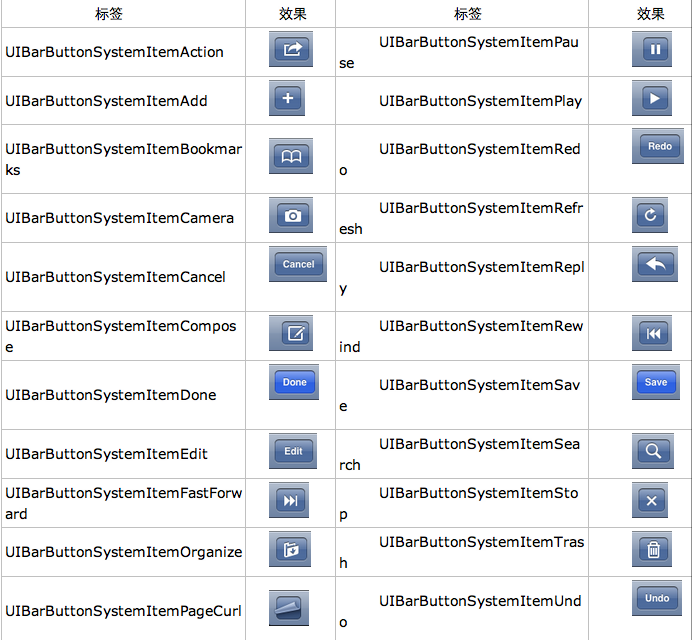

## TabBarView

手动创建

	1. UITabBarController 对象
	2. Tab 要显示的对象
	3. Content ViewController
	4. 设置UITabBarController为window.rootViewController

```objectivec
- (BOOL)application:(UIApplication *)application didFinishLaunchingWithOptions:(NSDictionary *)launchOptions
{
    self.window = [[[UIWindow alloc] initWithFrame:[[UIScreen mainScreen] bounds]] autorelease];
    // Override point for customization after application launch.
    
　　 SvTabBarFirstViewController *viewController1, *viewController2;

    viewController1 = [[SvTabBarFirstViewController alloc] initWithNibName:nil bundle:nil];
    viewController1.title = @"First";
    
    viewController2 = [[SvTabBarFirstViewController alloc] initWithNibName:nil bundle:nil];
    viewController2.title = @"Second";
    
    self.tabBarController = [[[UITabBarController alloc] init] autorelease];
    self.tabBarController.delegate = self;
    self.tabBarController.viewControllers = [NSArray arrayWithObjects:viewController1, viewController2, nil];

    [viewController1 release];
    [viewController2 release];
    
    self.window.rootViewController = self.tabBarController;
    [self.window makeKeyAndVisible];
    
    return YES;
}
```

UITabBarItem

	UITabBarItem *item = [[UITabBarItem alloc] initWithTitle:@"Second" image:nil tag:2];
	[item setFinishedSelectedImage:[UIImage imageNamed:@"second.png"] withFinishedUnselectedImage:[UIImage imageNamed:@"first.png"]];
	tabBarController.tabBarItem = item;
	[item release];
	
最多显示5个Tab

Rotation

	UITabBarController默认只支持竖屏, 仅当所有的viewController都支持该方向时, UITabBarController才会发生旋转, 而且发生旋转的时候, 只有当前显示的viewController会接收到旋转的消息. 
	
Change Selected Viewcontroller

	selectedIndex, selectedViewController, viewController 属性
	
UITabBarControllerDelegate

	控制TabBarItem能不能选中
	- (BOOL)tabBarController:shouldSelectViewController:	- (void)tabBarController:willBeginCustomizingViewControllers:	- (void)tabBarController:willEndCustomizingViewControllers:changed:
	- (void)tabBarController:didEndCustomizingViewControllers:changed:

	
Index: 

	UITabBarController *tabBarController = segue.destinationViewController;
	UINavigationController *navigationController = (UINavigationController *)[[tabBarController viewControllers] objectAtIndex:0];
	createTeamViewController *controller = (createTeamViewController *)[[navigationController viewControllers] objectAtIndex:0];
	
	
Navigation View Controller :

