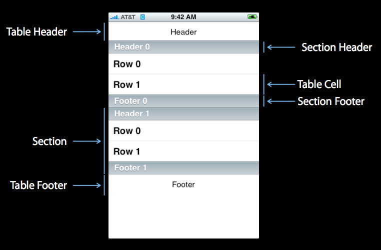
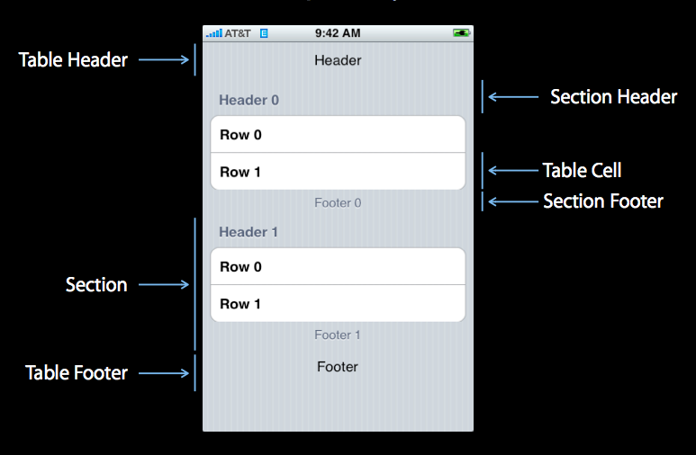
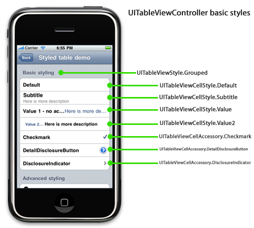

## TableView

A table view has a data source and might have a delegate. The **data source** object provides the data for populating the sections and rows of the table view. The **delegate** object customizes its appearance and behavior.

	UITableViewController
		* implements the protocols : UITableViewDatasource and UITableViewDelegate
		* ensures consistency with the existing data source (model)
	
	<UITableViewDataSource>
		* Provide size of data
			- numberOfSectionsInTableView:
			
			//how many rows to display in each section
			- tableView:numberOfRowsInSection: 
			
		* Provid data
			//provides the cell to display for each row in the table
			- tableView:cellForRowAtIndexPath: 

			//provid a section title
			- tableView:titleForHeaderInSection: 

			//indent a row
			- tableView:indentationLevelForRowAtIndexPath: 

			//vary a row's height
			- tableView:heightForRowAtIndexPath: 

			//quick search list
			- sectionIndexTitlesForTableView:			
		* Manage editing
			- tableView:canEditRowAtIndexPath:
			- tableView:commitEditingStyle:forRowAtIndexPath:
	
	<UITableViewDelegate>
		* Respond to selection 
			- tableView:didSelectRowAtIndexPath:
			- deselectRowAtIndexPath:animated:
			
			//edit style
			- tableView:accessoryButtonTappedForRowWithIndexPath:
			- tableView:editingStyleForRowAtIndexPath: 

			//move action
			- tableView:canMoveRowAtIndexPath:
			- tableView:targetIndexPathForMoveFromRowAtIndexPath:toProposedIndexPath:
			- tableView:moveRowAtIndexPath:toIndexPath:

			//edit action
			- tableView:canEditRowAtIndexPath:
			- tableView:commitEditingStyle:forRowAtIndexPath:
			- insertRowsAtIndexPath:withRowAnimation:
			- deleteRowsAtIndexPath:withRowAnimation:
			- tableView:moveRowAtIndexPath:toIndexPath:


			NSArray *operaterIndexPaths = [NSArray arrayWithObjects:
							[NSIndexPath indexPathForRow:0 inSection:0],
							[NSIndexPath indexPathForRow:3 inSection:0],
							[NSIndexPath indexPathForRow:5 inSection:0],
							nil];
			- (void)beginUpdates;

			- (void)insertSections:withRowAnimation:
			- (void)deleteSections:withRowAnimation:
			- (void)reloadSections:withRowAnimation:
			- (void)insertRowsAtIndexPaths:withRowAnimation:
			- (void)deleteRowsAtIndexPaths:withRowAnimation:
			- (void)reloadRowsAtIndexPaths:withRowAnimation:
			
			- (void)endUpdates;

			- tableView:editActionsForRowAtIndexPath:
			

A table view should interact with : the view controller, the table view itself, and the table view's data source and delegate. The view controller, data source, and delegate are usually the same object.

UITableViewController automatically creates a table view, assigns itself as both delegate and data source (and adopts the corresponding protocols), and initiates the procedure for populating the table view with data.

UITableViewCell : dynamic prototypes : static cells : Custom

Accessory View : table view cell's accessory

	cell.imageView.image
	cell.imageView.highlightedImage
	cell.textLabel.text
	cell.detailTextLabel.text
	cell.textLabel.font = [UIFont boldSystemFontOfSize:50];
	
	UITableViewCell : 
		* UITableViewCellStyleDefault
		* UITableViewCellStyleSubtitle
		* UITableViewCellStyleValue1
		* UITableViewCellStyleValue2

	cell.accessoryType :
		* UITableViewCellAccessoryNone
		* UITableViewCellAccessoryCheckmark
		* UITableViewCellAccessoryDetailDisclosureButton
		* UITableViewCellAccessoryDisclosureIndicator

	// 表格是否可以编辑
	[tableView setEditing:YES animated:YES];
	
		UITableViewCellEditingStyleDelete
		UITableViewCellEditingStyleInsert
		UITableViewCellEditingStyleNone

	// 右上角编辑按钮
	self.navigationItem.rightBarButtonItem = self.editButtonItem;

	// 删除
		UITableViewRowAnimationAutomatic
		UITableViewRowAnimationTop
		UITableViewRowAnimationBottom
		UITableViewRowAnimationLeft
		UITableViewRowAnimationRight
		UITableViewRowAnimationMiddle
		UITableViewRowAnimationFade
		UITableViewRowAnimationNone


### Style

	UITableView Style :
		style : Plain, Grouped
		
		section : Header, Footer	
	
	UITableViewCell Style :
		UITableViewCellStyleDefault : ImageView + textLabel
		UITableViewCellStyleValue1 : textLabel + detailTextLabel
		UITableViewCellStyleValue2 : detailTextLabel + textLabel
		UITableViewCellStyleSubtitle : textLabel +| detailTextLabel
		
		cell.backgroundColor
		cell.tintColor
		cell.selectionStyle : None, Blue, Gray
		cell.accessoryType
		
	Custom Cell :
		: UITableViewCell
		
	Accessory Type :
		cell.accessoryView






## Reality

* 点击Cell A中的按钮后 Cell B做出响应

	重点在TableView中给Cell A的按钮添加事件, 并在TableView Controller中处理事件

```objectivec
-(UITableViewCell *)tableView:(UITableView *)tableView cellForRowAtIndexPath:(NSIndexPath *)indexPath
{
    NSString *cellIndentifier = @"CellIndentfier";

    UITableViewCell *cell = [tableView dequeueReusableCellWithIdentifier:cellIndentifier];//cell是在storyBoard里创建的，所以直接获取就好
    cell.selectionStyle = UITableViewCellAccessoryNone;//让整个cell点击无效果
    
    UIButton *firstButton = (UIButton *)[cell viewWithTag:kCell_ButtonTag_1];
    [firstButton addTarget:self action:@selector(gradeBtnPressed:) forControlEvents:UIControlEventTouchUpInside];
    return cell;
}

-(void)gradeBtnPressed:(id)sender
{
    UITableViewCell * cell = (UITableViewCell *)[[[sender superview] superview] superview];//根据button加在cell上的层次关系，一层层获取其所在的cell（我的层次关系是：cell-》ImageView—》Label-》Button，所以要获取三次取得cell）

    NSIndexPath * indexPath = [self.onlineListTableView indexPathForCell:cell];//获得cell所在的表格行row和section

    UIButton *button = (UIButton *)sender;
}
```

* 下拉刷新

```objectivec
UIRefreshControl *refresh = [[UIRefreshControl alloc] init];
refresh.tintColor = [UIColor blueColor];
[refresh addTarget:self action:@selector(pullToRefresh) forControlEvents:UIControlEventValueChanged];
self.refreshControl = refresh;

- (void)pullToRefresh  
{
	double delayInSeconds = 1.5;  
	dispatch_time_t popTime = dispatch_time(DISPATCH_TIME_NOW, (int64_t)(delayInSeconds * NSEC_PER_SEC));  
	dispatch_after(popTime, dispatch_get_main_queue(), ^(void){  
		_rowCount += 5;  
		[self.tableView reloadData];  
		//刷新结束时刷新控件的设置  
		[self.refreshControl endRefreshing];
	});  
}  
```

* 顶部空白

```objectivec
self.automaticallyAdjustsScrollViewInsets = NO;
```

* Table Row Actions

```objectivec
- (NSArray *)tableView:(UITableView *)tableView editActionsForRowAtIndexPath:(NSIndexPath *)indexPath {
    
    UITableViewRowAction *destructive;
    UITableViewRowAction *normal;
    UITableViewRowAction *customized1;
    UITableViewRowAction *customized2;

    destructive = [UITableViewRowAction rowActionWithStyle:UITableViewRowActionStyleDestructive title:@"dest" handler:^(UITableViewRowAction *action, NSIndexPath *indexPath) {
		}];

    normal = [UITableViewRowAction rowActionWithStyle:UITableViewRowActionStyleNormal title:@"norm" handler:^(UITableViewRowAction *action, NSIndexPath *indexPath) {
		}];

    customized1 = [UITableViewRowAction rowActionWithStyle:UITableViewRowActionStyleDefault title:@"cus1" handler:^(UITableViewRowAction *action, NSIndexPath *indexPath) {
		}];
    customized1.backgroundColor = [UIColor greenColor];

    customized2 = [UITableViewRowAction rowActionWithStyle:UITableViewRowActionStyleDefault title:@"cus2" handler:^(UITableViewRowAction *action, NSIndexPath *indexPath) {
		}];
    customized2.backgroundEffect = [UIBlurEffect effectWithStyle:UIBlurEffectStyleDark];

    return @[destructive, normal, customized1, customized2];
}
```